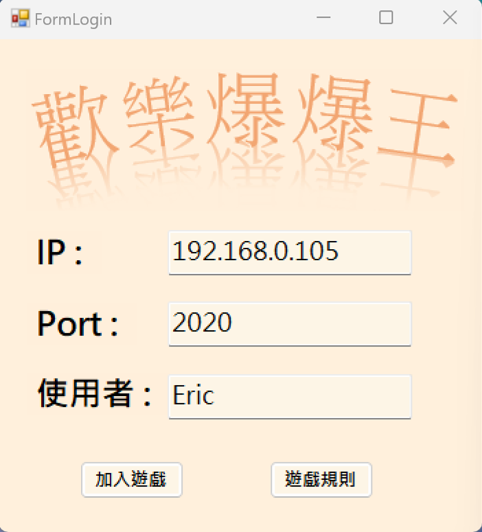
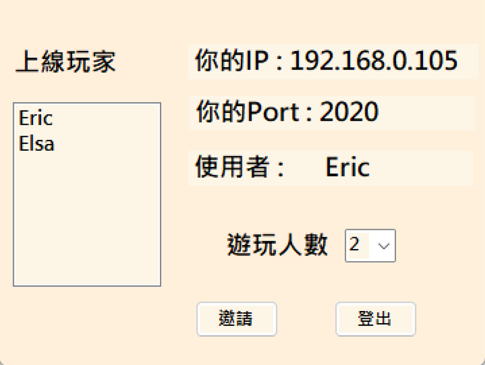
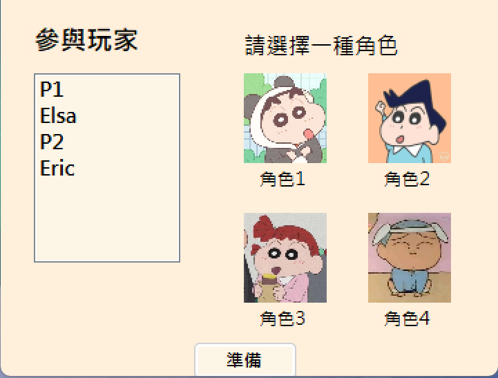
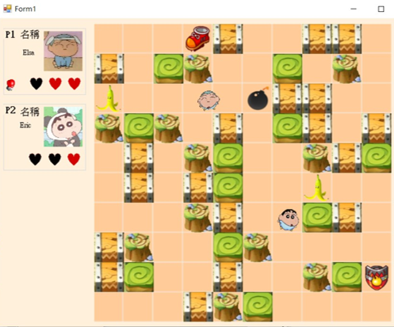
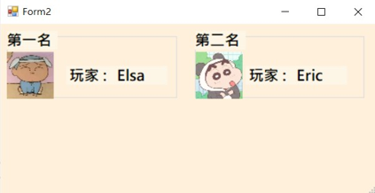

# 爆爆王專案

## 專案簡介

「爆爆王」是一個多人在線遊戲，專案分為伺服器端與客戶端兩部分。伺服器端主要負責處理玩家的登入、選擇角色、遊戲狀態管理及數據同步；客戶端則提供玩家與遊戲的互動介面。伺服器使用 TCP 通訊協定來實現玩家之間的即時通訊和資料傳輸，確保遊戲過程中的低延遲和高效數據同步。

## 專案架構

### 1. 伺服器端
伺服器端使用 C# 開發，並透過 TCP 協議實現以下功能：
- **玩家登入系統**：處理用戶帳號和密碼的驗證，確保只有合法用戶能進入遊戲。
- **選擇角色**：在登入成功後，玩家可以選擇自己喜歡的角色，角色信息會通過伺服器同步到遊戲中。
- **遊戲資料管理**：伺服器負責管理遊戲中的所有動作，包括玩家位置、炸彈放置、爆炸範圍等，並確保每位玩家接收到正確的遊戲狀態。
- **實時同步**：伺服器不斷接收來自每位玩家的數據，並根據遊戲邏輯進行處理後將更新狀態回傳給所有連線的客戶端，實現遊戲畫面和動作的實時同步。

### 2. 客戶端
客戶端同樣由 C# 開發，負責玩家與遊戲的互動：
- **圖形介面**：顯示遊戲場景、角色和炸彈效果，並提供玩家控制角色移動與炸彈操作的功能。
- **伺服器連線**：客戶端會與伺服器建立 TCP 連線，接收遊戲數據並根據伺服器回傳的狀態進行遊戲畫面的即時更新。
- **角色控制**：玩家可以通過鍵盤控制角色的移動和炸彈放置，並參與即時對戰。

## 使用技術
- **伺服器端**：C#，TCP 協議
- **客戶端**：C#，圖形介面設計（GDI+ 或其他相關技術）
- **網絡通訊**：TCP 協議，用於實現伺服器與客戶端的數據同步

## 專案設置與運行

### 伺服器端：
1. 下載並安裝必要的依賴庫（如 .NET Framework）。
2. 編譯伺服器端專案。
3. 執行伺服器端程式，伺服器將開始監聽來自客戶端的連接請求。
4. 設定伺服器 IP 和埠，確保伺服器與客戶端之間的通訊能正常運行。

### 客戶端：
1. 編譯客戶端專案。
2. 執行客戶端程式，並輸入伺服器 IP 和埠進行連接。
3. 完成登入後，選擇角色並開始遊玩。

以下是將遊戲規則修改為 README 格式的內容：

---

# 爆爆王 - 遊戲規則

## 遊戲目標
在場上與其他玩家對戰，使用各種道具與策略將對手淘汰，當場上剩餘最後一位玩家時，該玩家獲勝。遊戲依照被淘汰的順序進行排名。

## 基本規則
- 每位玩家擁有 **三條命**，當玩家的生命數歸零時，遊戲結束並被淘汰。
- 當只剩下一名玩家存活時，依據被淘汰的順序決定最終排名。

## 場上道具
遊戲中提供了多種道具來幫助或干擾玩家，使用這些道具能影響遊戲進程：

1. **鞋子**：
   - **效果**：移動速度加快。
   - **持續時間**：8秒。

2. **盾牌**：
   - **效果**：在6秒內保護玩家不受攻擊。
   - **持續時間**：6秒。

3. **香蕉**：
   - **效果**：使玩家不能移動。
   - **持續時間**：2秒。

4. **拳頭**：
   - **效果**：增加玩家攻擊範圍，周圍攻擊範圍擴大兩倍。
   - **適用範圍**：周圍兩倍範圍內的敵人受到攻擊。

5. **愛心**：
   - **效果**：恢復一條命。
   - **限制**：當玩家生命數未滿時有效，滿血狀態下無法回復。

## 遊戲畫面
# 爆爆王 - 遊戲說明

## 未來改進計畫
- **改進遊戲畫面**：進一步優化遊戲的圖形界面和特效。
- **增加更多遊戲模式**：未來將實現更多不同玩法的遊戲模式，如團隊對戰或積分排名系統。
- **優化網絡性能**：提升伺服器處理能力，減少延遲和高峰時段的卡頓現象。
